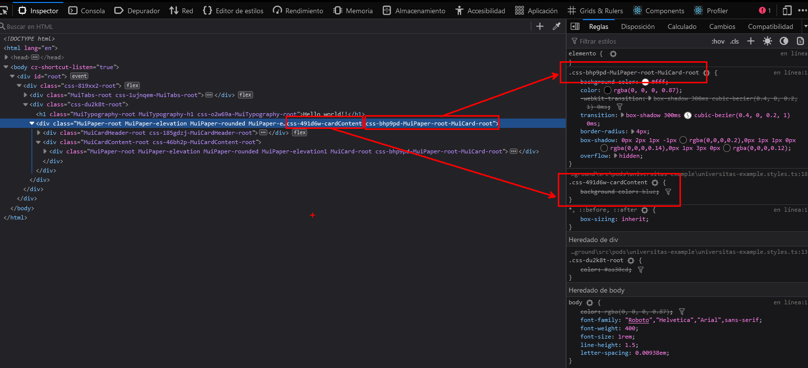

# Ejemplo de estilos con Emotion en MUI5

---

**En este ejercicio vamos a analizar e implementar una hoja de estilos siguiendo los estándares que nos propone [Material UI](https://mui.com/material-ui/getting-started/installation/) en su versión 5.**

La librería de estilos que vamos a utilizar es la misma que utiliza **Material** en esta nueva versión: **[Emotion CSS](https://emotion.sh/docs/introduction)**. Esta librería utiliza una sintaxis mucho más cercana al lenguage **CSS** o pre-procesadores tipo **SASS** que su antecesora **JSS** en formato **json**, con lo que escribir estilos nos debería resultar mucho más cómodo y sencillo.

Un primer vistazo a la [documentación oficial](https://mui.com/system/basics/) nos indica que funciones como **makeStyles** o **useTheme** pese a poder seguir utilizándolas han quedado deprecadas y no sería buena práctica su uso.

Dicho esto, para poder utilizar el **Theme** en nuestros componentes se ha creado un hook en la librería el cual no solo permite pasarle el tema utitlizado sino también propiedades que podamos necesitar en nuestras hojas de estilos. Su utilización la veremos más adelantes.

## 01 - Playground

Vamos a crear un componente sencillo junto con su hoja de estilos donde iremos utilizando distintos componentes de MUI5 y les daremos estilos según la documentación.

- Para los estilos necesitamos importar la función `css` de **Emotion**. Su utilización es muy sencilla, basta con añadir los estilos css entre los backticks.

  ```ts
  // universitas-example.styles.ts

  import { css } from '@emotion/css';

  export const root = css`
    color: red;
  `;
  ```

- En el componente usamos los estilos como se ve a continuación.

  ```tsx
  // universitas-example.component.tsx

  import React from 'react';
  import { Typography } from '@mui/material';
  import * as innerClasses from './universitas-example.styles'; // Hacemos una importación nombrada de las classes

  export const UniversitasComponent: React.FunctionComponent = () => {
    return (
      <div className={innerClasses.root}>
        // Asignamos la clase correspondiente al elemento
        <Typography variant="h1">Hello world!!</Typography>
      </div>
    );
  };
  ```

## 02 - Clases básico

Como podemos observar en la documentación de **MUI5** la utilización de las clases en los componentes ha cambiado. Antes disponíamos de la propiedad `className` que atacaba al elemento raíz y de la propiedad `classes` que incluía las distintas clases que pudiera tener ese componente. Esta última propiedad es la que ha quedado deprecada con lo que tendremos que utilizar las diferentes clases que nos proporciona MUI pero atacándolas desde el elemento raíz.

Vamos a añadir el component `Card` de Material a nuestro componente y en los estilos utilizaremos la clase que nos proporciona para modificarlo.

```diff
// universitas-example.component.tsx

import React from 'react';
-  import { Typography } from '@mui/material';
+  import { Typography, Card } from '@mui/material';
import * as innerClasses from './universitas-example.styles';

export const UniversitasComponent: React.FunctionComponent = () => {
  return (
    <div className={innerClasses.root}>
      <Typography variant="h1">Hello world!!</Typography>
+     <Card></Card>
    </div>
  );
};
```

Podemos utilizar las clases de formas:

- Una sería desde la documentación de **MUI** y compiando el literal de la clase que nos interese. En este caso la clase es ` .MuiCard-root`.
- O bien podemos importar el objeto con todas las clases del componente como haremos en este ejemplo. **Importante añadir el punto antes de la clase**.

```diff
// universitas-example.styles.ts

import { css } from '@emotion/css';
+ import { cardClasses } from '@mui/material';

export const root = css`
  color: red;

// Ejemplo con el literal: & .MuiCard-root {...styles}

+  & .${cardClasses.root} {
+    height: max-content;
+    width: max-content;
+    background-color: red;
+  }
`;
```

## 03 - Clases básico II (Especificidad)

Ahora añadiremos nuevos elementos a nuestro componente y veremos como afectan los estilos en función de su anidamiento, lo que conocemos como especificidad.

```diff
// universitas-example.component.tsx

import React from 'react';
-  import { Typography, Card } from '@mui/material';
+  import { Typography, Card, CardHeader, CardContent } from '@mui/material';
import * as innerClasses from './universitas-example.styles';

export const UniversitasComponent: React.FunctionComponent = () => {
  return (
    <div className={innerClasses.root}>
      <Typography variant="h1">Hello world!!</Typography>
      <Card>
+        <CardHeader title="Card Header" />
+        <CardContent>
+          <h2>Card Content</h2>
+        </CardContent>
      </Card>
    </div>
  );
};
```

En los estilos importamos las clases de los componentes y añadimos los estilos como en el paso anterior.

```diff
// universitas-example.styles.ts

import { css } from '@emotion/css';
- import { cardClasses } from '@mui/material';
+ import { cardClasses, cardHeaderClasses, cardContentClasses } from '@mui/material';

export const root = css`
  color: red;


  & .${cardClasses.root} {
    height: max-content;
    width: max-content;
    background-color: red;
  }

+  & .${cardHeaderClasses.title} {
+    color: white;
+  }
+
+  & .${cardContentClasses.root} {
+    background-color: whitesmoke;
+  }
`;
```

Todo funciona como esperábamos pero, ¿Qué ocurrirá si el `h2` del `CardContent` lo envolvemos en otra `Card`?... pues que esta toma los mismos estilos que la primera porque ambas tienen la misma clases.

```diff
// universitas-example.component.tsx

import React from 'react';
import { Typography, Card, CardHeader, CardContent } from '@mui/material';
import * as innerClasses from './universitas-example.styles';

export const UniversitasComponent: React.FunctionComponent = () => {
  return (
    <div className={innerClasses.root}>
      <Typography variant="h1">Hello world!!</Typography>
      <Card>
        <CardHeader title="Card Header" />
        <CardContent>
+          <Card>
            <h2>Card Content</h2>
+          </Card>
        </CardContent>
      </Card>
    </div>
  );
};
```

Si observamos el código con el inspector del navegador podemos verlo más claro:


## Clases avanzado

Cuando en un componente solo existen elementos únicos tenemos una mayor flexibilidad a la hora de utilizar los nombres de clases para aplicar los estilos, pero son muchos los casos en que un componente contiene varios elementos del mismo tipo pero y cada aplica sus características y estilos. Por ejemplo es muy común encontrar diferentes elementos `<Typography>` dentro de un componente.

Para evitar casos como en el ejemplo anterior y tener un mayor control de los estilos que cada elemento necesita, veremos nuevas formas de utilizar las clases y de qué manera estas afectan a los componentes.

Lo que veremos en esta sección no es nada específico de **MUI** o **Emotion** sino de reglas puras **CSS** a la hora de combinar clases (combinadores) y la especificidad que estas reglas aplican.

Vamos a comenzar cambiando nuestro componente. Al elemento `<Cad>` padre le hemos añadido la clase `cardRoot` y hemos sustituido el elemento `<h2>` por un `<Typography>`.

```diff
// universitas-example.component.tsx

import React from 'react';
import { Typography, Card, CardHeader, CardContent } from '@mui/material';
import * as innerClasses from './universitas-example.styles';

export const UniversitasComponent: React.FunctionComponent = () => {
  return (
    <div className={innerClasses.root}>
      <Typography variant="h1">Hello world!!</Typography>
-      <Card>
+      <Card className={innerClasses.cardRoot}>
        <CardHeader title="Card Header" />
        <CardContent>
          <Card>
-            <h2>Card Content</h2>
+            <Typography variant="h2">Card Content</Typography>
          </Card>
        </CardContent>
      </Card>
    </div>
  );
};
```

Pasemos a modificar los estilos. Lo primero que hacemos es crear la clase `cardContent` y movemos dentro las clases de los elementos `Card` y sus estilos.

```diff
// universitas-example.styles.ts

import { css } from '@emotion/css';
import { cardClasses, cardHeaderClasses, cardContentClasses } from '@mui/material';

export const root = css`
  color: red;


-  & .${cardClasses.root} {
-    height: max-content;
-    width: max-content;
-    background-color: red;
-  }
-
-  & .${cardHeaderClasses.title} {
-    color: white;
-  }
-
-  & .${cardContentClasses.root} {
-    background-color: whitesmoke;
-  }
`;

+ export const cardContent = css`
+   & .${cardClasses.root} {
+     height: max-content;
+     width: max-content;
+     background-color: red;
+   }
+
+   & .${cardHeaderClasses.title} {
+     color: white;
+   }
+
+   & .${cardContentClasses.root} {
+     background-color: whitesmoke;
+   }
+ `;
```

¿Qué sucede con las `Cards`?... Ahora los estilos de la clase `cardClasses.root` solo afectan a la **Card** hija, pero ¿Por qué?... Para entender bien esto y los siguientes pasos nuestro mejor aliado será el navegador y su inspector de código.

Vamos a agregar un color de fondo al raíz de la card y observar que sucede desde el navegador:

```diff
// universitas-example.styles.ts

import { css } from '@emotion/css';
import { cardClasses, cardHeaderClasses, cardContentClasses } from '@mui/material';

export const root = css`
  color: red;
`;

 export const cardContent = css`
+  background-color: blue;

   & .${cardClasses.root} {
     height: max-content;
     width: max-content;
     background-color: red;
   }

   & .${cardHeaderClasses.title} {
     color: white;
   }

   & .${cardContentClasses.root} {
     background-color: whitesmoke;
   }
 `;
```


