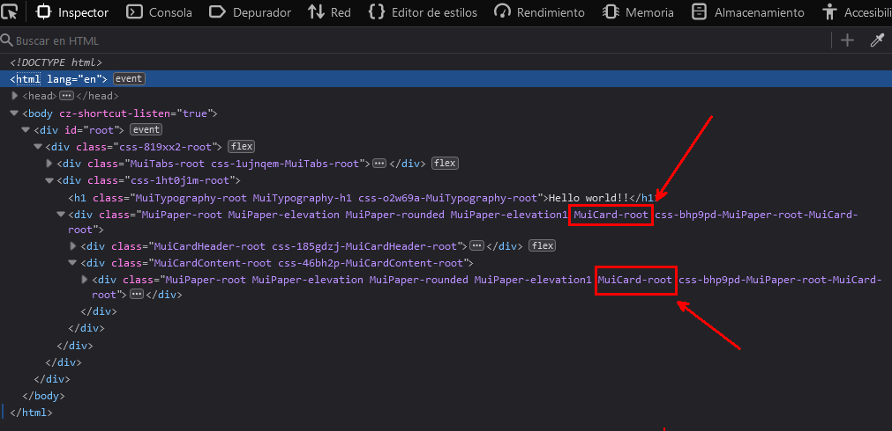

# Ejemplo de estilos con Emotion en MUI5

---

**En este ejercicio vamos a analizar e implementar una hoja de estilos siguiendo los estándares que nos propone [Material UI](https://mui.com/material-ui/getting-started/installation/) en su versión 5.**

La librería de estilos que vamos a utilizar es la misma que utiliza **Material** en esta nueva versión: **[Emotion CSS](https://emotion.sh/docs/introduction)**. Esta librería utiliza una sintaxis mucho más cercana al lenguage **CSS** o a pre-procesadores tipo **SASS** que su antecesora **JSS** en formato **json**, con lo que escribir estilos nos debería resultar mucho más cómodo y sencillo.

Un primer vistazo a la [documentación oficial](https://mui.com/system/basics/) nos indica que funciones como **makeStyles** o **useTheme** pese a poder seguir utilizándolas han quedado deprecadas y no sería buena práctica su uso.

Dicho esto, para poder utilizar el **Theme** en nuestros componentes se ha creado un hook en la librería el cual no solo permite pasarle el tema utitlizado sino también propiedades que podamos necesitar en nuestras hojas de estilos. Su utilización la veremos más adelantes.

## 01 - Playground

Vamos a crear un componente sencillo junto con su hoja de estilos donde iremos utilizando distintos componentes de MUI5 y les daremos estilos según la documentación.

- Para los estilos necesitamos importar la función `css` de **Emotion**. Su utilización es muy sencilla, basta con añadir los estilos css entre los backticks.

  ```ts
  // universitas-example.styles.ts

  import { css } from '@emotion/css';

  export const root = css`
    color: red;
  `;
  ```

- En el componente usamos los estilos como se ve a continuación.

  ```tsx
  // universitas-example.component.tsx

  import React from 'react';
  import { Typography } from '@mui/material';
  import * as innerClasses from './universitas-example.styles'; // Hacemos una importación nombrada de las classes

  export const UniversitasComponent: React.FunctionComponent = () => {
    return (
      <div className={innerClasses.root}> <!-- Asignamos la clase correspondiente al elemento -->
        <Typography variant="h1">Hello world!!</Typography>
      </div>
    );
  };
  ```

## 02 - Clases básico

Como podemos observar en la documentación de **MUI5** la utilización de las clases en los componentes ha cambiado. Antes disponíamos de la propiedad `className` que atacaba al elemento raíz y de la propiedad `classes` que incluía las distintas clases que pudiera tener ese componente. Esta última propiedad es la que ha quedado deprecada con lo que tendremos que utilizar las diferentes clases que nos proporciona MUI pero atacándolas desde el elemento raíz.

Vamos a añadir el component `Card` de Material a nuestro componente y en los estilos utilizaremos la clase que nos proporciona para modificarlo.

```diff
// universitas-example.component.tsx

import React from 'react';
-  import { Typography } from '@mui/material';
+  import { Typography, Card } from '@mui/material';
import * as innerClasses from './universitas-example.styles';

export const UniversitasComponent: React.FunctionComponent = () => {
  return (
    <div className={innerClasses.root}>
      <Typography variant="h1">Hello world!!</Typography>
+     <Card></Card>
    </div>
  );
};
```

Podemos utilizar las clases de dos formas:

- Una sería desde la documentación de **MUI** y compiando el literal de la clase que nos interese. En este caso la clase es ` .MuiCard-root`.
- O bien podemos importar el objeto con todas las clases del componente como haremos en este ejemplo.

> **Importante añadir el punto antes de la clase: `.${nameClass.root}`**

```diff
// universitas-example.styles.ts

import { css } from '@emotion/css';
+ import { cardClasses } from '@mui/material';

export const root = css`
  color: red;

// Ejemplo con el literal: & .MuiCard-root {...styles}

+  & .${cardClasses.root} {
+    height: max-content;
+    width: max-content;
+    background-color: red;
+  }
`;
```

## 03 - Clases básico II (Especificidad)

Ahora añadiremos nuevos elementos a nuestro componente y veremos como afectan los estilos en función de su anidamiento, lo que conocemos como especificidad.

```diff
// universitas-example.component.tsx

import React from 'react';
-  import { Typography, Card } from '@mui/material';
+  import { Typography, Card, CardHeader, CardContent } from '@mui/material';
import * as innerClasses from './universitas-example.styles';

export const UniversitasComponent: React.FunctionComponent = () => {
  return (
    <div className={innerClasses.root}>
      <Typography variant="h1">Hello world!!</Typography>
      <Card>
+        <CardHeader title="Card Header" />
+        <CardContent>
+          <h2>Card Content</h2>
+        </CardContent>
      </Card>
    </div>
  );
};
```

En los estilos importamos las clases de los componentes y añadimos los estilos como en el paso anterior.

```diff
// universitas-example.styles.ts

import { css } from '@emotion/css';
- import { cardClasses } from '@mui/material';
+ import { cardClasses, cardHeaderClasses, cardContentClasses } from '@mui/material';

export const root = css`
  color: red;


  & .${cardClasses.root} {
    height: max-content;
    width: max-content;
    background-color: red;
  }

+  & .${cardHeaderClasses.title} {
+    color: white;
+  }
+
+  & .${cardContentClasses.root} {
+    background-color: whitesmoke;
+  }
`;
```

Todo funciona como esperábamos pero, ¿Qué ocurrirá si el `h2` del `CardContent` lo envolvemos en otra `Card`?... pues que esta toma los mismos estilos que la primera porque ambas tienen la misma clases.

```diff
// universitas-example.component.tsx

import React from 'react';
import { Typography, Card, CardHeader, CardContent } from '@mui/material';
import * as innerClasses from './universitas-example.styles';

export const UniversitasComponent: React.FunctionComponent = () => {
  return (
    <div className={innerClasses.root}>
      <Typography variant="h1">Hello world!!</Typography>
      <Card>
        <CardHeader title="Card Header" />
        <CardContent>
+          <Card>
            <h2>Card Content</h2>
+          </Card>
        </CardContent>
      </Card>
    </div>
  );
};
```

Si observamos el código con el inspector del navegador podemos verlo más claro:



## Clases avanzado (Selectores y especificidad)

Cuando en un componente solo existen elementos únicos tenemos una mayor flexibilidad a la hora de utilizar los nombres de clases para aplicar los estilos, pero son muchos los casos en que un componente contiene varios elementos del mismo tipo y cada uno aplica sus características y estilos. Por ejemplo es muy común encontrar diferentes elementos `<Typography>` dentro de un componente.

Para evitar casos como en el ejemplo anterior y tener un mayor control de los estilos que cada elemento necesita, veremos nuevas formas de utilizar las clases y de qué manera estas afectan a los componentes.

Lo que veremos en esta sección no es nada específico de **MUI** o **Emotion** sino de reglas puras **CSS** utilizando selectores y la especificidad que estos aplican.

Vamos a comenzar cambiando nuestro componente. Al elemento `<Card>` padre le hemos añadido la clase `mainCard` y hemos sustituido el elemento `<h2>` por un `<Typography>`.

```diff
// universitas-example.component.tsx

import React from 'react';
import { Typography, Card, CardHeader, CardContent } from '@mui/material';
import * as innerClasses from './universitas-example.styles';

export const UniversitasComponent: React.FunctionComponent = () => {
  return (
    <div className={innerClasses.root}>
      <Typography variant="h1">Hello world!!</Typography>
-      <Card>
+      <Card className={innerClasses.mainCard}>
        <CardHeader title="Card Header" />
        <CardContent>
          <Card>
-            <h2>Card Content</h2>
+            <Typography variant="h2">Card Content</Typography>
          </Card>
        </CardContent>
      </Card>
    </div>
  );
};
```

Pasemos a modificar los estilos. Lo primero que hacemos es crear la clase `cardContent` y movemos dentro las clases de los elementos `Card` y sus estilos.

```diff
// universitas-example.styles.ts

import { css } from '@emotion/css';
import { cardClasses, cardHeaderClasses, cardContentClasses } from '@mui/material';

export const root = css`
  color: red;


-  & .${cardClasses.root} {
-    height: max-content;
-    width: max-content;
-    background-color: red;
-  }
-
-  & .${cardHeaderClasses.title} {
-    color: white;
-  }
-
-  & .${cardContentClasses.root} {
-    background-color: whitesmoke;
-  }
`;

+ export const mainCard = css`
+   & .${cardClasses.root} {
+     height: max-content;
+     width: max-content;
+     background-color: red;
+   }
+
+   & .${cardHeaderClasses.title} {
+     color: white;
+   }
+
+   & .${cardContentClasses.root} {
+     background-color: whitesmoke;
+   }
+ `;
```

¿Qué sucede con las `Cards`?... Ahora los estilos de la clase `cardClasses.root` solo afectan a la **Card** hija, pero ¿Por qué?... Porque estamos utilizando anidamiento de clases, es decir, estamos diciendo que todos los elementos con la clase `cardClasses.root` que se encuentren dentro del elemento padre con la clases `mainCard` se les apliquen estos estilos. En **CSS** los escribiríamos así:

```css
.mainCard .cardClassesRoot {
  height: max-content;
  width: max-content;
  background-color: red;
}
```

Vamos a agregar un color de fondo a la card principal.

```diff
// universitas-example.styles.ts

import { css } from '@emotion/css';
import { cardClasses, cardHeaderClasses, cardContentClasses } from '@mui/material';

export const root = css`
  color: red;
`;

 export const mainCard = css`
+  background-color: blue;

   & .${cardClasses.root} {
     height: max-content;
     width: max-content;
     background-color: red;
   }

   & .${cardHeaderClasses.title} {
     color: white;
   }

   & .${cardContentClasses.root} {
     background-color: whitesmoke;
   }
 `;
```

Veamos que pasa si eliminamos el espacio entre el ampersand (que hace referencia a la clase mainCard) y el nombre de la clase.

```diff
// universitas-example.styles.ts

import { css } from '@emotion/css';
import { cardClasses, cardHeaderClasses, cardContentClasses } from '@mui/material';

export const root = css`
  color: red;
`;

 export const mainCard = css`
    background-color: blue;

-   & .${cardClasses.root} {
+   &.${cardClasses.root} {
     height: max-content;
     width: max-content;
     background-color: red;
   }

   & .${cardHeaderClasses.title} {
     color: white;
   }

   & .${cardContentClasses.root} {
     background-color: whitesmoke;
   }
 `;
```

Qué ha sucedido:

- El fondo azul ha sido sustituido por el rojo y los estilos solo aplican a la `Card` principal. Esto es así porque estamos indicando que se apliquen a todo elemento que contenga las clases `mainCard` y `cardClasses.root`.

- Por otro lado el fondo azul a cambiado por el rojo debido a la especificidad. Dicho con palabras sería algo como: _"Tiene más peso decir: ***Pinta de rojo a todo el que tenga las clases mainCard y cardClasses.root*** que ***Pinta de azul a todo el que tenga la clase mainCard***"_.

Sigamos jugando. Si quisíeramos aplicar los mismo estilos a las dos `cards` podríamos hacerlo de la siguiente forma:

```diff
// universitas-example.styles.ts

import { css } from '@emotion/css';
import { cardClasses, cardHeaderClasses, cardContentClasses } from '@mui/material';

export const root = css`
  color: red;
`;

 export const mainCard = css`
-    background-color: blue;

-   &.${cardClasses.root} {
+   &.${cardClasses.root}, & .${cardClasses.root} {
     height: max-content;
     width: max-content;
     background-color: red;
   }

   & .${cardHeaderClasses.title} {
     color: white;
   }

   & .${cardContentClasses.root} {
     background-color: whitesmoke;
   }
 `;
```

Si por ejemplo solo queremos cambiar el color de fondo a la segunda `card` añadiríamos esto:

```diff
// universitas-example.styles.ts

import { css } from '@emotion/css';
import { cardClasses, cardHeaderClasses, cardContentClasses } from '@mui/material';

export const root = css`
  color: red;
`;

 export const mainCard = css`
    background-color: blue;

   &.${cardClasses.root}, & .${cardClasses.root} {
     height: max-content;
     width: max-content;
     background-color: red;
   }

+   & .${cardClasses.root} {
+    background-color: blue;
+   }

   & .${cardHeaderClasses.title} {
     color: white;
   }

   & .${cardContentClasses.root} {
     background-color: whitesmoke;
   }
 `;
```

## Optimización

Hasta ahora hemos visto como atacar a distintos elementos desde un contenedor padre. Lo hemos hecho así porque hay casos en los que es la única forma de estilar las distintas partes de un componente, bien sea porque **MUI** así lo implementa, o si el componente es propio porque así lo hemos decicido no exponiendo sus clases.

Este ejemplo no es el caso, ya que si nos fijamos podemos utilizar el `className` de cada elemento para inyectar sus clases.

Empecemos con las `cars`, creando una clase específica para cada una. Este componente de **MUI** solo dispone de una clase interna `root` con lo que en este caso ya no será necesaria.

```diff
// universitas-example.styles.ts

import { css } from '@emotion/css';
- import { cardClasses, cardHeaderClasses, cardContentClasses } from '@mui/material';
+ import { cardHeaderClasses, cardContentClasses } from '@mui/material';

export const root = css`
  color: red;
`;

 export const mainCard = css`
-    background-color: blue;

-   &.${cardClasses.root}, & .${cardClasses.root} {
     height: max-content;
     width: max-content;
     background-color: red;
-   }

-   & .${cardClasses.root} {
-    background-color: blue;
-   }

   & .${cardHeaderClasses.title} {
     color: white;
   }

   & .${cardContentClasses.root} {
     background-color: whitesmoke;
   }
 `;

+  export const secondaryCard = css`
+    height: max-content;
+    width: max-content;
+    background-color: blue;
+  `;
```

```diff
// universitas-example.component.tsx

import React from 'react';
import { Typography, Card, CardHeader, CardContent } from '@mui/material';
import * as innerClasses from './universitas-example.styles';

export const UniversitasComponent: React.FunctionComponent = () => {
  return (
    <div className={innerClasses.root}>
      <Typography variant="h1">Hello world!!</Typography>
      <Card className={innerClasses.mainCard}>
        <CardHeader title="Card Header" />
        <CardContent>
-          <Card>
+          <Card className={innerClasses.secondaryCard}>
            <Typography variant="h2">Card Content</Typography>
          </Card>
        </CardContent>
      </Card>
    </div>
  );
};
```

Hagamos lo mismo con los componentes `CardHeader` y `CardContent`. En el caso de `CardHeader` sí utilizaremos sus clases ya que solo queremos que el estilo de `color` afecte al título.

```diff
// universitas-example.styles.ts

import { css } from '@emotion/css';
- import { cardHeaderClasses, cardContentClasses } from '@mui/material';
+ import { cardHeaderClasses } from '@mui/material';

export const root = css`
  color: red;
`;

 export const mainCard = css`
     height: max-content;
     width: max-content;
     background-color: red;

-   & .${cardHeaderClasses.title} {
-     color: white;
-   }
-
-   & .${cardContentClasses.root} {
-     background-color: whitesmoke;
-   }
 `;

  export const secondaryCard = css`
    height: max-content;
    width: max-content;
    background-color: blue;
  `;

+  export const cardHeader = css`
+    & .${cardHeaderClasses.title} {
+      color: white;
+    }
+  `;
+
+  export const cardContent = css`
+    background-color: whitesmoke;
+  `;
```

```diff
// universitas-example.component.tsx

import React from 'react';
import { Typography, Card, CardHeader, CardContent } from '@mui/material';
import * as innerClasses from './universitas-example.styles';

export const UniversitasComponent: React.FunctionComponent = () => {
  return (
    <div className={innerClasses.root}>
      <Typography variant="h1">Hello world!!</Typography>
      <Card className={innerClasses.mainCard}>
-        <CardHeader title="Card Header" />
+        <CardHeader className={innerClasses.cardHeader} title="Card Header" />
-        <CardContent>
+        <CardContent className={innerClasses.cardContent}>
+          <Card className={innerClasses.secondaryCard}>
            <Typography variant="h2">Card Content</Typography>
          </Card>
        </CardContent>
      </Card>
    </div>
  );
};
```

## 06 - Usando el Theme

En esta sección vamos a implementar los estilos utilizando el `Theme`, ya sea uno personalizado o el de por defecto que nos ofrece **Material**.

Si hemos trabajado con versiones anteriores a **MUI5** y hemos estilado con **JSS** nos tienen que sonar funciones como `makeStyles`, `useTheme` o `useStyles`. Todas estas funciones pese a poder seguir siendo utilizadas han sido deprecadas y no se recomienda su uso.

Para poder utilizar el `Theme` y como sustituto de las funciones anteriores hemos creado el **hook** `useWithTheme` que se encargará de que todo funcione. `useWithTheme` es usado en cada componente y al cual le pasaremos las clases y las propiedades que necesitemos en los estilos. Las propiedades las veremos en el siguiente apartado.

La importación de `useWithTheme` se hace desde el `core` de la librería.

No todas las clases usarán el `theme` así que estas pueden ser usadas tanto desde el `hook` como de desde los estilos. Aunque quizás, una vez usamos `useWithTheme` lo más recomendable sea utilizarlo por consistencia.

```diff
// universitas-example.component.tsx

import React from 'react';
- import { Typography, Card, CardHeader, CardContent } from '@mui/material';
+ import { Typography, Card, CardHeader, CardContent, useWithTheme } from '@mui/material';
import * as innerClasses from './universitas-example.styles';

export const UniversitasComponent: React.FunctionComponent = () => {
+ const classes = useWithTheme(innerClasses);

  return (
-    <div className={innerClasses.root}>
+    <div className={classes.root}>
      <Typography variant="h1">Hello world!!</Typography>
      <Card className={innerClasses.mainCard}>
        <CardHeader className={innerClasses.cardHeader} title="Card Header" />
        <CardContent className={innerClasses.cardContent}>
          <Card className={innerClasses.secondaryCard}>
            <Typography variant="h2">Card Content</Typography>
          </Card>
        </CardContent>
      </Card>
    </div>
  );
};
```

En los estilos importaremos la interface `Theme` de Material para el tipado. Las clases que lo requieran habrá que convertirlas a función y el `theme` será pasado por parámetros, quedando los estilos de la siguiente forma:

```diff
// universitas-example.styles.ts

import { css } from '@emotion/css';
- import { cardHeaderClasses } from '@mui/material';
+ import { cardHeaderClasses, Theme } from '@mui/material';

- export const root = css`
-  color: red;
+ export const root = (theme: Theme) => css`
+  color: ${theme.palette.primary.main};
`;

 export const mainCard = css`
     height: max-content;
     width: max-content;
     background-color: red;


  export const secondaryCard = css`
    height: max-content;
    width: max-content;
    background-color: blue;
  `;

  export const cardHeader = css`
    & .${cardHeaderClasses.title} {
      color: white;
    }
  `;

  export const cardContent = css`
    background-color: whitesmoke;
  `;
```

## 07 - Pasando propiedades

En ocasiones necesitaremos pasar propiedades a nuestros estilos. Estas propiedades las definiremos creando una interfaz y serán pasadas como segundo parámetro a la función de la clases.

```diff
// universitas-example.styles.ts

import { css } from '@emotion/css';
import { cardHeaderClasses, Theme } from '@mui/material';

+  interface Props {
+    isTrue: boolean;
+  }

- export const root = (theme: Theme) => css`
+ export const root = (theme: Theme, props: Props) => css`
-  color: ${theme.palette.primary.main};
+  color: ${props.isTrue ? theme.palette.primary.main : theme.palette.secondary.main};
`;

 export const mainCard = css`
     height: max-content;
     width: max-content;
     background-color: red;


  export const secondaryCard = css`
    height: max-content;
    width: max-content;
    background-color: blue;
  `;

  export const cardHeader = css`
    & .${cardHeaderClasses.title} {
      color: white;
    }
  `;

  export const cardContent = css`
    background-color: whitesmoke;
  `;
```

```diff
// universitas-example.component.tsx

import React from 'react';
import { Typography, Card, CardHeader, CardContent, useWithTheme } from '@mui/material';
import * as innerClasses from './universitas-example.styles';

export const UniversitasComponent: React.FunctionComponent = () => {
+  const primaryColor: boolean = false
- const classes = useWithTheme(innerClasses);
+ const classes = useWithTheme(innerClasses, {isTrue: primaryColor});

  return (
    <div className={classes.root}>
      <Typography variant="h1">Hello world!!</Typography>
      <Card className={innerClasses.mainCard}>
        <CardHeader className={innerClasses.cardHeader} title="Card Header" />
        <CardContent className={innerClasses.cardContent}>
          <Card className={innerClasses.secondaryCard}>
            <Typography variant="h2">Card Content</Typography>
          </Card>
        </CardContent>
      </Card>
    </div>
  );
};
```
